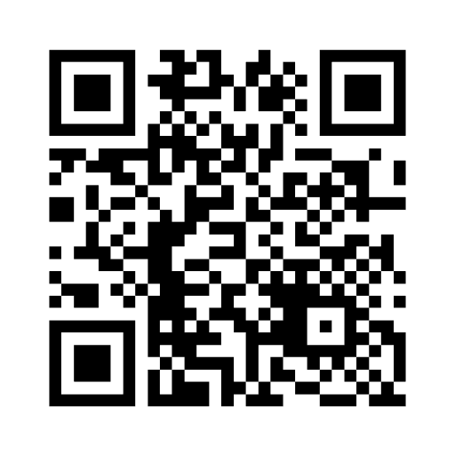
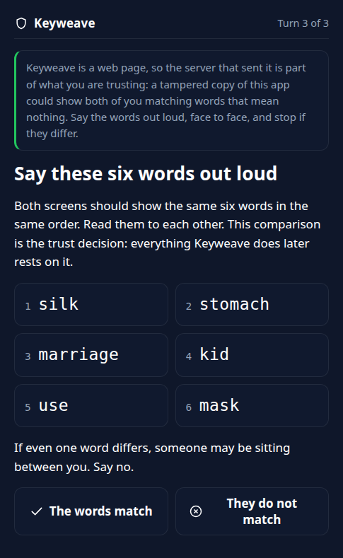
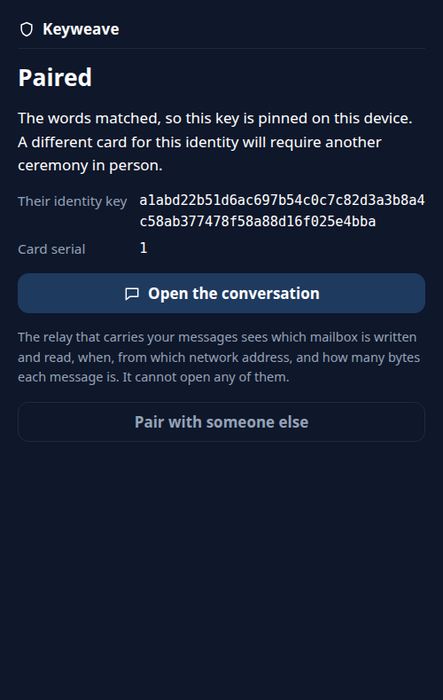
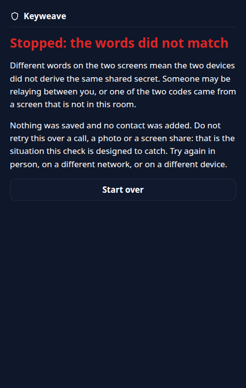

# Keyweave

Meet once with light, then talk over the open internet with confidence about who you are
talking to.

Keyweave is a secure messenger with an unusual trust model. Two people pair **in person** by
pointing one phone's camera at another phone's screen, which streams a signed contact card as an
animated QR code (embedding the fountain-coded optical transport from
[decimen-optical-transfer](https://github.com/bashalarmistalt/decimen-optical-transfer)). Because a
camera pointed at a screen cannot be intercepted from the network, **physical presence is the
authentication**, which is the part end-to-end-encrypted systems usually leave to the user
(Signal's safety numbers, PGP's web of trust). After pairing, messages travel over ordinary
clearnet as sealed ciphertext through a dumb mailbox relay. The relay never sees plaintext or
identity keys; like any server it does see timing, sizes and network addresses (R3 below).

## Try it

The app is live at **https://keyweave.localfirstlab.org**. That URL is the application itself and
not a page about it: it serves the v0.1.2 bundle, and on 2026-08-13 the bytes it served were
checked file by file against the hashes in the signed `v0.1.2` tag. Its relay runs on a separate
host at `https://relay.keyweave.localfirstlab.org` and answers only under `/v1/`, so a plain
`GET /` there returns 404 by design and is not an outage. An illustrated explanation, which is a
page about it, lives at https://localfirstlab.org/keyweave.html.

Pairing needs two devices in the same room, each with a camera and a screen, both with the app
open: one shows the animated symbol while the other scans it, then the two swap roles, and both
people compare six words aloud before either presses "The words match". A single device can
create an identity and look around, but it cannot finish a ceremony alone. The vault is sealed
with a passphrase that is escrowed nowhere, so forgetting it loses that identity. Three more
things are worth knowing before you start.

- **Using the hosted app means trusting the code that origin serves you.** A browser re-fetches its
  JavaScript on every load, and optical pairing does nothing about a malicious bundle: that is the
  top residual, R1 in [docs/NAMED-RESIDUALS.md](docs/NAMED-RESIDUALS.md). To check rather than
  trust, compare the bytes your browser received against the signed tag: reasoning in
  [docs/REPRODUCIBLE-BUILD.md](docs/REPRODUCIBLE-BUILD.md), runnable block in step 8 of
  [docs/DEPLOY-APP.md](docs/DEPLOY-APP.md).
- **Sending is not instant.** The local vault is re-sealed before and after the relay call and each
  seal re-runs the passphrase key derivation, so one successful send costs about 6.3 seconds of
  computation on the desktop it was measured on, by design (R22 records the measurement).
- **Pressing Show or Scan reserves a drop box at the relay** before anyone has decided anything, so
  the relay learns that a network address began a pairing at that moment, even for ceremonies the
  two people then refuse. It learns no identity and reads no plaintext. That is R19.

## What pairing looks like

These are captures of the app itself and not mock-ups.
[docs/media/PROVENANCE.md](docs/media/PROVENANCE.md) records, for each one, what was real in the
capture and what was a headless browser standing in for a person.



The code as it actually plays, recorded from the running app: 96 different codes in 9.6 seconds
and three switches between the two streams it alternates, so a camera that misses frames still
finishes the turn. One device shows this while the other watches it, then the two swap.



Both screens derive six words from the two keys, and reading them to each other is the trust
decision: everything Keyweave does afterwards rests on it. From a real ceremony on 2026-08-10
between two instances passing real codes over a virtual camera, where both screens did show these
same six words.



Agreeing pins that key on the device, and a different card for the same identity will need
another ceremony in person.



The other ending, from the same day's run with a third instance sitting between the two sides and
pairing with each of them as itself, which is why those screens showed different words. Nothing
was saved and no contact was added, though the relay had already seen a pairing begin, which is
R19 above.

Three more screens, and the still frame shown in place of the animation when a browser asks for
reduced motion, are in [docs/media/](docs/media/).

## What Keyweave protects, and what it does not

Keyweave aims to be honest about its limits. In plain terms:

- **Protects:** an in-person-authenticated identity (the relay never learns your identity keys),
  message confidentiality and integrity against the relay and the network.
- **Does not protect (v0):** the integrity of the code your browser is served (R1 above), traffic
  metadata (an observer of the relay can see which mailboxes talk to each other by timing and
  network address, R3), forward secrecy (a later key compromise can decrypt past messages, R4), or
  a compromised or stolen unlocked device (R5).

Those R-numbers are entries in [docs/NAMED-RESIDUALS.md](docs/NAMED-RESIDUALS.md), which states
each limit, what it costs, and what would close it.

## Status

Early development, and deployed. v0 is deliberately small: optical pairing (SAS-with-DH
verification) plus static-key sealed-box messaging plus a pull-model mailbox relay, text only. No
forward secrecy, groups, or multi-device yet.

**v0.1.2 is the current release and its tag is signed.** It supersedes v0.1.1, a signed prerelease
carrying two claims since withdrawn; v0.1.0 is unsigned and stays unsigned, because signing it now
would mean moving a published tag. Both halves run: the app origin above serves the attested v0.1.2
bundle, and the relay is on a host of its own, which is what R2 asks for, since one host serving
both would make a single compromise a total break.

What has been run in a browser rather than inferred: a full three-turn ceremony on two physical
devices on 2026-08-09, and the three arms that remained after it, the mismatch refusal, camera
denial and the insecure-context control, headlessly against a real virtual camera on 2026-08-10. No
test here has lit two screens at once in front of two people comparing words to each other, which
is what R15 still names.

## Verifying a release

A release publishes the sha256 of every file in the built bundle so that the bundle can be checked
rather than taken on trust. **The signed tag message is the authoritative record of those hashes.**
The GitHub release body repeats them, but it is editable by whoever holds the account and carries
no signature, so it is a readable copy, never the record. In a clone of this repository:

```sh
curl -fsSL https://localfirstlab.org/keyweave-release-key.asc | gpg --import
git verify-tag v0.1.2   # good signature, fingerprint D78D89413752779209479B9ACF5C8AB3DB4A56EB
git cat-file -p v0.1.2  # the signed message: build inputs and artifact hashes
```

Compare the whole fingerprint, never a suffix; [docs/REPRODUCIBLE-BUILD.md](docs/REPRODUCIBLE-BUILD.md)
prints the same one and explains what the signature does and does not prove. The key comes from
`localfirstlab.org` and not from GitHub on purpose: a key served by the same host that serves the
tag proves nothing. **GitHub shows these tags as "Unverified", which is expected**, because the
signing key is deliberately not registered with the GitHub account, so GitHub genuinely cannot
check it and says so.

Then rebuild and compare. `scripts/reproduce.sh` clones this repository at a git ref, installs the
committed lockfile with `npm ci` into a fresh directory, builds, and prints every file's hash:

```sh
KEYWEAVE_RELAY_ORIGIN=https://relay.keyweave.localfirstlab.org scripts/reproduce.sh v0.1.2
```

The hashes are a function of the commit AND of that variable, which is baked into the bundle, so
the script refuses to guess one: either pass the origin the tag message names, or pass
`KEYWEAVE_SAME_ORIGIN=1` to build a same-origin bundle on purpose. The v0.1.2 tag message publishes
a labelled block per configuration, deployed-origin first and same-origin second. Compare against
the block whose build inputs match yours, and there every file must match: one differing file is a
failed verification, not a curiosity. Most files agree across the two blocks anyway, because only
some files embed the relay location, so agreement with the other block's build proves nothing
about yours.

[docs/REPRODUCIBLE-BUILD.md](docs/REPRODUCIBLE-BUILD.md) is the longer version: what a matching
hash does and does not prove, how to compare the bytes your own browser received, and which
corroborations have been run rather than planned.

## Running it locally

```sh
cd client
npm install
npm run dev        # loopback only, 127.0.0.1:5173
npm run build      # emits dist/
npm run gate       # typecheck plus the whole suite
```

The camera needs a secure context, so pairing works on `localhost` or over HTTPS and nowhere else.
There is no CI runner in this repository: `npm test` run by whoever touches the code is what
"enforced" means, and it includes the build-time assertion that no external origin survives in
`dist/`.

The relay is Python with nothing outside the standard library, and so is its suite:

```sh
python3 -m unittest discover -s relay/tests -t .
```

Running a relay for real means a config file, nginx in front and a systemd unit, which is what
[docs/DEPLOY.md](docs/DEPLOY.md) walks through. Its step 1 config example is written for that
setup, not for standalone use: it sets header-trust flags that are only correct behind the
runbook's nginx.

## Running your own

Nothing in the design requires our hosts. Two runbooks, each written to be pasted a block at a
time and asserting before it acts, plus one explainer:

- **The relay host:** [docs/DEPLOY.md](docs/DEPLOY.md), through config, nginx, systemd and fail2ban.
- **The app host:** [docs/DEPLOY-APP.md](docs/DEPLOY-APP.md), through DNS, certificate, vhost and
  response headers, the build at a tag, the upload, and verification from outside, including the
  served-bytes check against the signed tag.
- **Why one variable does so much:** [docs/DEPLOY-CSP.md](docs/DEPLOY-CSP.md).
  `KEYWEAVE_RELAY_ORIGIN` sets the compiled relay URL, the policy in the page and the policy header,
  and the three have to agree.

Keep the app and the relay on separate hosts if you can (R2), and read the residuals before telling
anyone else to use what you deployed.

## Layout

- `client/` - the browser client (TypeScript): key management, contact cards, pairing crypto,
  message sealing, the encrypted local vault, and the pairing app in `client/src/ui/`. The pinned
  optical transport is vendored under `client/vendor/decimen/`, with its provenance beside it.
- `relay/` - the mailbox relay (Python, standard library), its systemd unit, its nginx location
  block, and `RELAY-RESIDUALS.md` for the relay's own limits.
- `scripts/` - `reproduce.sh`, which rebuilds the client from a git ref and prints the artifact
  hashes. See "Verifying a release" above.

The documents in `docs/`, by what you came to find out: how the halves fit together,
`ARCHITECTURE.md`; who can do what to you, `THREAT-MODEL.md`; the limits, numbered, each with what
would close it, `NAMED-RESIDUALS.md`; how to check the bytes, `REPRODUCIBLE-BUILD.md`; the design
review this version was built against, which is also the build contract,
`keyweave-v0-hardened-spec.md`; and how to host it, `DEPLOY.md` for the relay, `DEPLOY-APP.md` for
the app, `DEPLOY-CSP.md` for the policy.

## Reporting a vulnerability

Privately, please: **hello@localfirstlab.org**, optionally encrypted to the release signing key
above. [SECURITY.md](SECURITY.md) has the details and what to expect in response.

## License

MIT (see `LICENSE`). Third-party attributions in `NOTICE`.
